# Project_template

Это шаблон для решения проектной работы. Структура этого файла повторяет структуру заданий. Заполняйте его по мере работы над решением.

# Задание 1. Анализ и планирование

<aside>

Чтобы составить документ с описанием текущей архитектуры приложения, можно часть информации взять из описания компании и условия задания. Это нормально.

</aside

### 1. Описание функциональности монолитного приложения

**Управление отоплением:**

- Пользователи могут удалённо включать и выключать отопление в каждом из своих домов через веб-интерфейс.
- Система хранит текущее состояние отопления (включено/выключено) для каждого дома и передаёт соответствующую команду на оборудование отопления (котёл/контроллер).
- Изменение состояния отопления выполняется синхронно, в рамках одного запроса пользователя, без постановки в очередь.

**Мониторинг температуры:**

- Датчики температуры, установленные в домах, поставляют показания, которые система делает доступными пользователю.
- Пользователи могут через веб-интерфейс просматривать текущую температуру по каждому датчику/комнате в своём доме.
- Система хранит метаданные датчика (тип, местоположение, единицы измерения, статус, время последнего обновления).
- При запросе показаний монолит обращается за актуальным значением к внешнему источнику данных датчиков (Temperature Sensors API) и обновляет им хранимые данные.

> Примечание: в предоставленном коде монолита (`apps/smart_home`, Go) реализован только домен мониторинга/учёта датчиков (`/api/v1/sensors/*`) — CRUD над датчиками и получение температуры. Явного API для включения/выключения отопления в коде нет, но эта функциональность входит в описание системы и обязательно учитывается при выделении доменов и проектировании микросервисов (Задание 2).

### 2. Анализ архитектуры монолитного приложения

- **Язык программирования:** Go, HTTP-роутинг и middleware — фреймворк Gin.
- **База данных:** одна база PostgreSQL (`smarthome`) с единственной таблицей `sensors` — общая для всей функциональности, отдельной модели для пользователей/домов/отопления нет.
- **Архитектура:** монолитная. Обработка HTTP-запросов, бизнес-логика и доступ к данным собраны в одном процессе и разворачиваются как единый артефакт (один бинарник/один контейнер `smarthome-app`).
- **Взаимодействие:** синхронное. Каждый запрос пользователя обрабатывается последовательно; для отдачи актуальной температуры монолит синхронно ходит по HTTP во внешний Temperature Sensors API и блокирует ответ пользователю до получения данных — очередей или асинхронной обработки нет.
- **Масштабируемость:** ограничена — масштабировать можно только всё приложение целиком (горизонтальные реплики одного и того же образа). Отдельно увеличить ёмкость под, например, частые чтения температуры, не затрагивая логику отопления, нельзя.
- **Развёртывание:** требует остановки/передеплоя всего приложения на любое изменение — правки в одном участке функциональности (скажем, в логике отопления) заставляют пересобирать и перезапускать весь монолит, включая никак не связанный с этим изменением мониторинг.
- **Внешняя зависимость:** монолит уже не полностью самодостаточен — показания температуры он получает по HTTP от внешнего Temperature Sensors API (эмулятор физических датчиков). Это интеграция на уровне источника данных/инфраструктуры, а не отдельный доменный микросервис с собственной бизнес-логикой.

### 3. Определение доменов и границы контекстов

**Домен «Управление устройствами» (Device Management)**

- Ответственность: реестр датчиков — регистрация, метаданные (тип, местоположение, единицы измерения), их привязка к дому, удаление/обновление конфигурации.
- Соответствует текущему `CRUD /api/v1/sensors` в монолите.

**Домен «Мониторинг температуры» (Temperature Monitoring)**

- Ответственность: приём и хранение показаний температуры, отдача текущего/исторического значения по датчику или комнате пользователю.
- Владеет интеграцией с внешним источником показаний (Temperature Sensors API) — для остальных доменов эта интеграция не видна.
- Выделен отдельно от «Управления устройствами», так как имеет другой профиль нагрузки (частые чтения/запись показаний) и может меняться независимо от логики регистрации устройств.

**Домен «Управление отоплением» (Heating Control)**

- Ответственность: хранение состояния отопления (включено/выключено) по каждому дому, приём команд от пользователя, отправка команд на оборудование отопления и обработка подтверждений.
- Выделен в отдельный домен, так как это критичная по времени и последствиям функция (влияет на реальное оборудование) с собственными правилами и жизненным циклом, не связанными с показаниями датчиков напрямую.

**Домен «Пользователи и дома» (User & Home Management)**

- Ответственность: учётные записи пользователей, регистрация домов, связь «пользователь → дом → устройства/отопление», права доступа (пользователь управляет только своими домами).
- В текущем коде монолита отсутствует (нет таблиц `users`/`homes`), но необходим как отдельный домен: остальные три домена должны проверять принадлежность датчика/дома конкретному пользователю, и эта логика не должна дублироваться в каждом из них.

**Обоснование границ.** Домены разделены по признаку разной скорости изменения и разной нагрузки: устройства меняются редко (конфигурация), показания температуры пишутся/читаются часто, команды отопления — редкие, но критичные и затрагивают внешнее оборудование, а пользователи/дома — это стабильные справочные данные, от которых зависят остальные домены, но которые сами не зависят от них.

### **4. Проблемы монолитного решения**

- **Совместное масштабирование.** Мониторинг температуры (частые чтения, в том числе синхронные обращения к внешнему API) и управление отоплением (редкие, но критичные по времени команды) вынуждены жить в одном процессе и масштабироваться вместе, хотя у них разный профиль нагрузки.
- **Общая точка отказа.** Ошибка, утечка ресурсов или деградация в одном участке кода (например, в обработке датчиков) способны уронить весь монолит, включая критичную функцию управления отоплением.
- **Совместное развёртывание.** Любое изменение — даже в одной изолированной функции — требует пересборки и передеплоя всего приложения, что увеличивает время и риск релиза и требует остановки всей системы.
- **Единая база данных.** Все функции работают с одной схемой PostgreSQL напрямую, что мешает независимо развивать модели данных разных доменов и создаёт неявные связи между ними на уровне таблиц.
- **Синхронная зависимость от внешнего источника данных.** Запрос пользователя блокируется на время ожидания ответа от Temperature Sensors API; деградация или недоступность этого внешнего сервиса напрямую замедляет или ломает основной API монолита.
- **Размытые границы ответственности.** Логика датчиков и (в перспективе) отопления существует в одних и тех же структурах и одном компоненте, что затрудняет параллельную разработку разными командами и повышает связность кода.

### 5. Визуализация контекста системы — диаграмма С4

Диаграмма контекста (C4 Context) построена в PlantUML с использованием стандартной библиотеки [C4-PlantUML](https://github.com/plantuml-stdlib/C4-PlantUML). Исходник: [`docs/c4/context.puml`](docs/c4/context.puml).

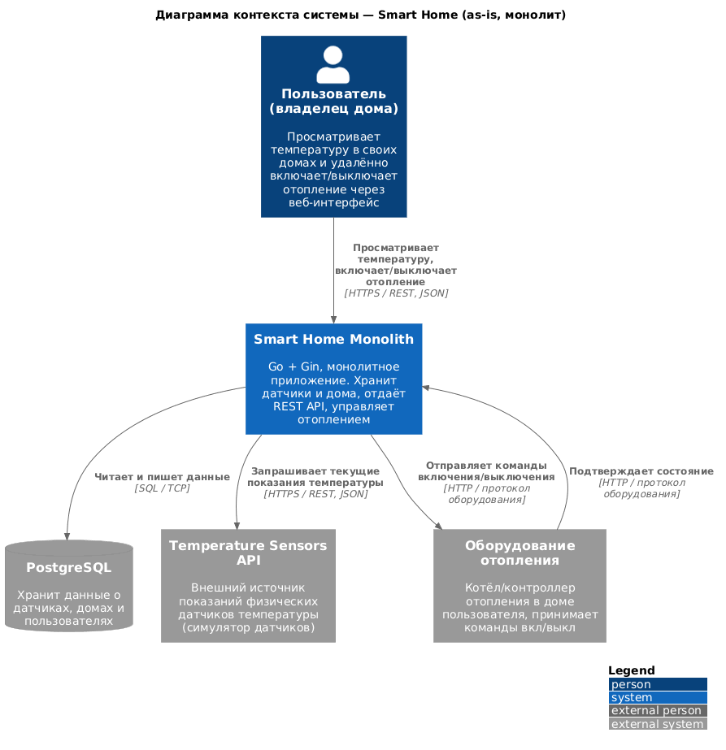

# Задание 2. Проектирование микросервисной архитектуры

В этом задании вам нужно предоставить только диаграммы в модели C4. Мы не просим вас отдельно описывать получившиеся микросервисы и то, как вы определили взаимодействия между компонентами To-Be системы. Если вы правильно подготовите диаграммы C4, они и так это покажут.

**Диаграмма контейнеров (Containers)**

Декомпозиция: `API Gateway`, `User & Home Service`, `Device Management Service`, `Temperature Monitoring Service`, `Heating Control Service`, `Notification Service` (новый сервис, не следует напрямую из доменов Задания 1, но нужен для оповещения пользователей — бизнес-требование). У каждого сервиса — своя база PostgreSQL (database per service). Асинхронное взаимодействие (события `TemperatureUpdated`, `HeatingStateChanged`) идёт через `Message Broker` (RabbitMQ) — на нём построена автоматика отопления и уведомления; клиентские запросы обслуживаются синхронно через `API Gateway` (REST/JSON).

Исходник: [`docs/c4/container.puml`](docs/c4/container.puml).

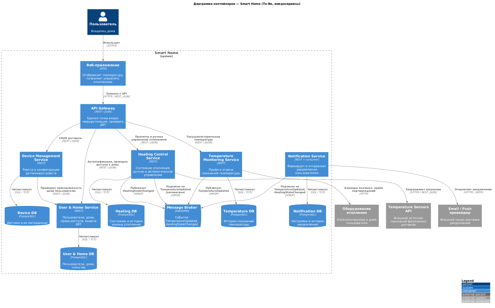

**Диаграмма компонентов (Components)**

По одной диаграмме на каждый выделенный микросервис.

- API Gateway — [`docs/c4/component-api-gateway.puml`](docs/c4/component-api-gateway.puml)

  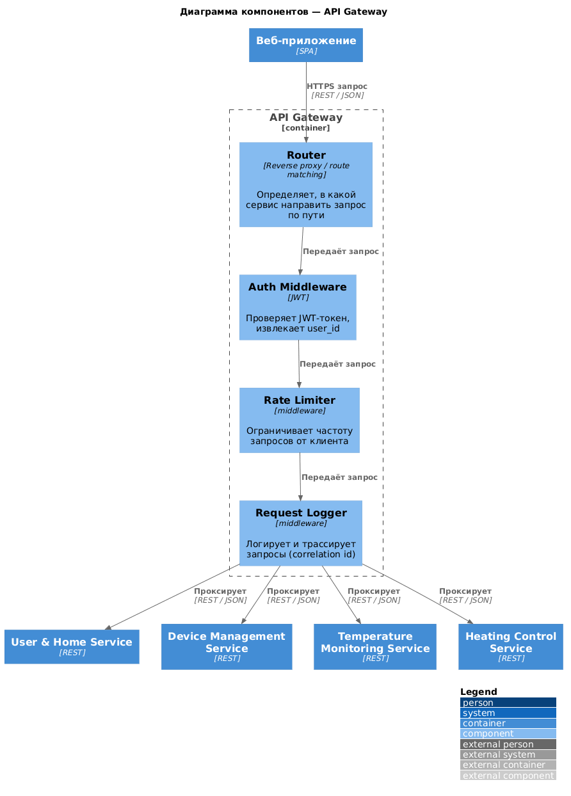

- User & Home Service — [`docs/c4/component-user-home.puml`](docs/c4/component-user-home.puml)

  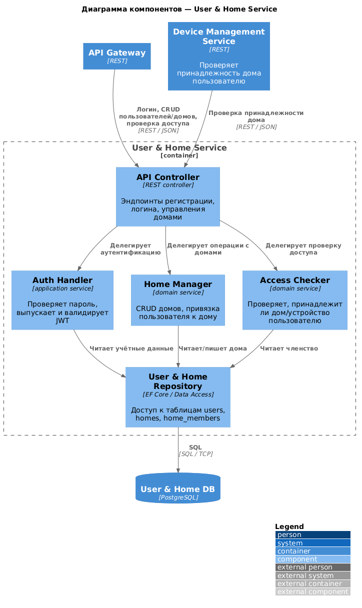

- Device Management Service — [`docs/c4/component-device-management.puml`](docs/c4/component-device-management.puml)

  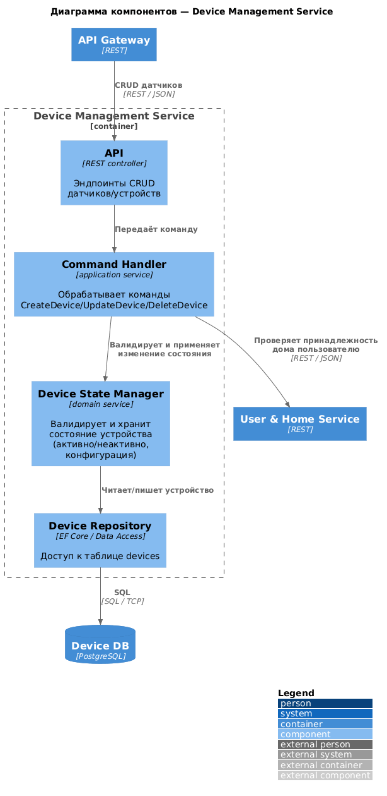

- Temperature Monitoring Service — [`docs/c4/component-temperature-monitoring.puml`](docs/c4/component-temperature-monitoring.puml)

  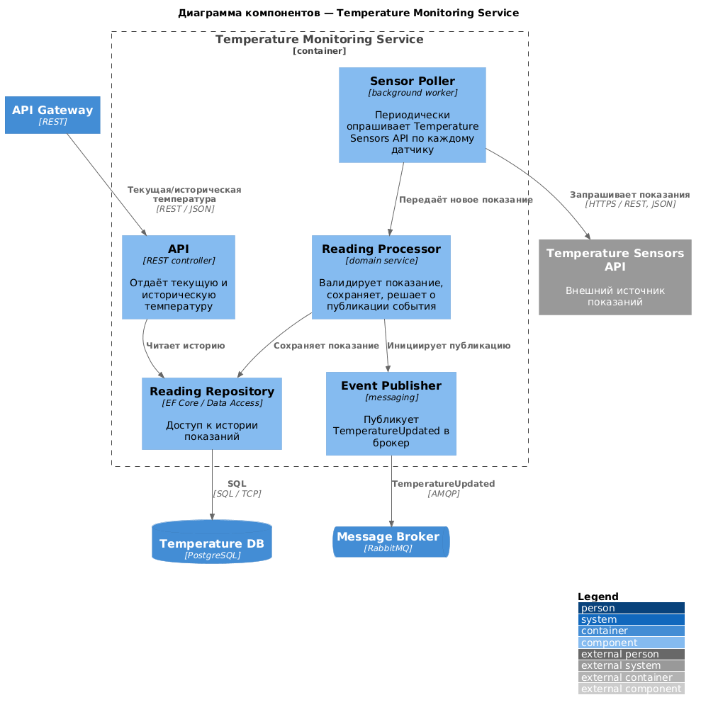

- Heating Control Service — [`docs/c4/component-heating-control.puml`](docs/c4/component-heating-control.puml)

  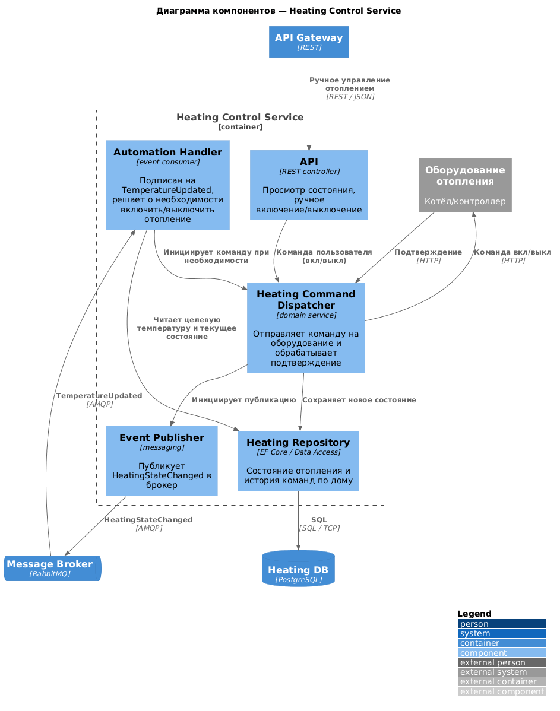

- Notification Service — [`docs/c4/component-notification.puml`](docs/c4/component-notification.puml)

  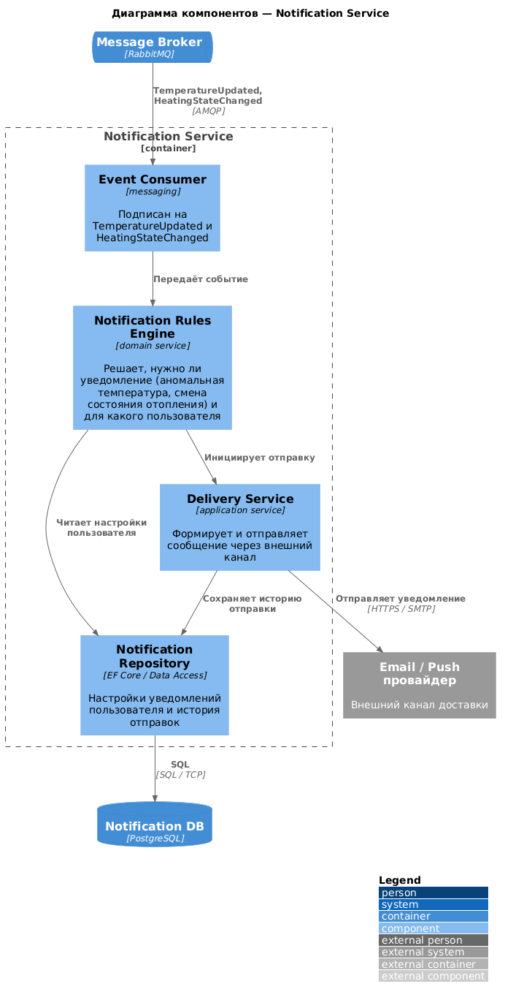

**Диаграмма кода (Code)**

Самая критичная часть системы — автоматическое управление отоплением по показаниям температуры (Heating Control Service): она затрагивает реальное оборудование, работает асинхронно через брокер сообщений и должна быть идемпотентной/предсказуемой.

Диаграмма последовательности — [`docs/c4/code-heating-automation-sequence.puml`](docs/c4/code-heating-automation-sequence.puml):

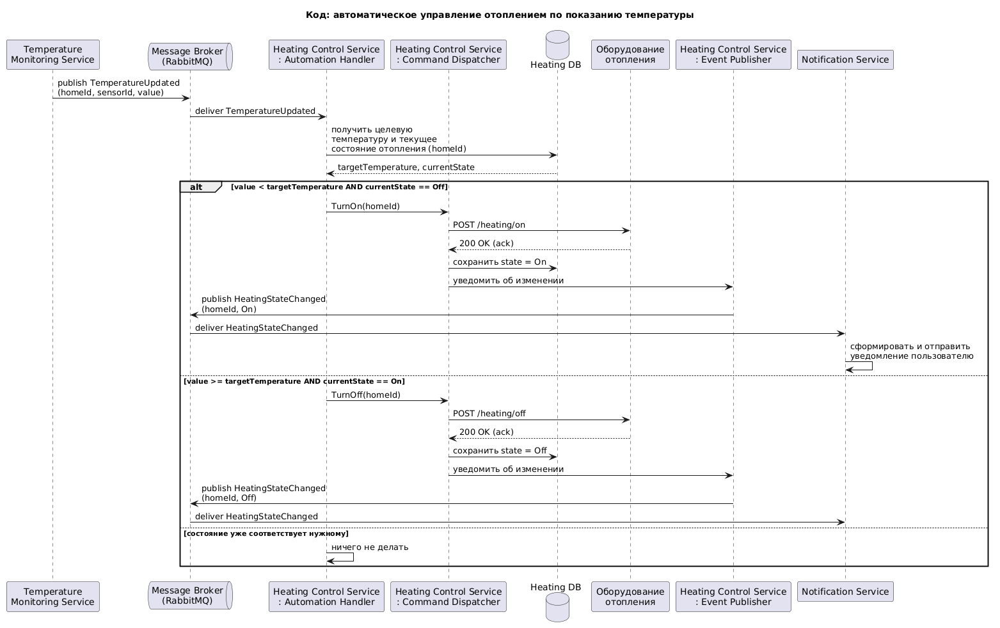

Диаграмма классов доменной модели — [`docs/c4/code-heating-domain-class.puml`](docs/c4/code-heating-domain-class.puml):

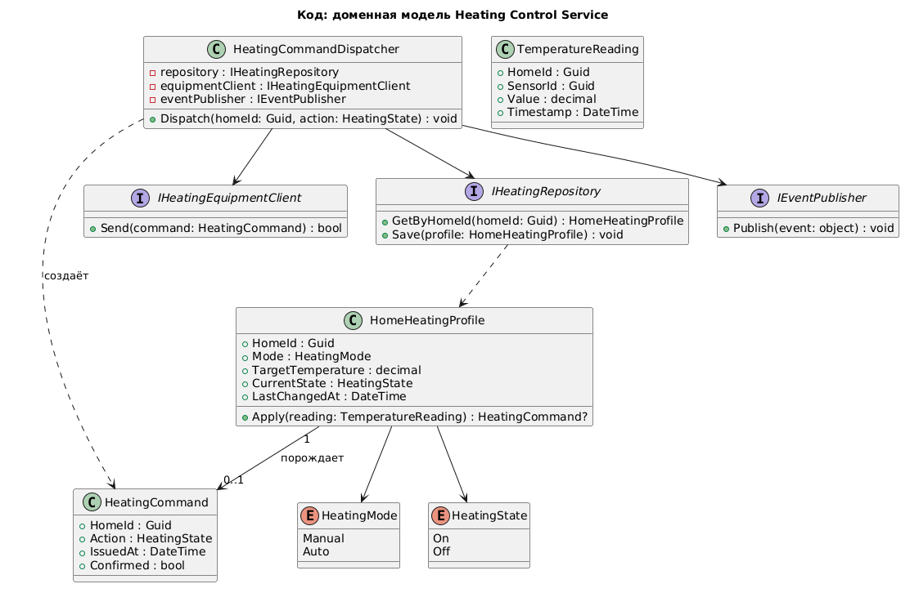

# Задание 3. Разработка ER-диаграммы

Логическая модель данных сгруппирована по владению — какой микросервис (Задание 2) является источником истины для какой сущности:

- **User & Home Service:** `User`, `House`. Один пользователь может владеть несколькими домами, но у каждого дома ровно один владелец (1 → N).
- **Device Management Service:** `DeviceType`, `Device`, `Module`. Один дом содержит много устройств (1 → N), у каждого устройства один тип (1 → N), устройство может состоять из нескольких модулей (1 → N).
- **Temperature Monitoring Service:** `TelemetryData`. Одно устройство генерирует множество записей телеметрии (1 → N).
- **Heating Control Service:** `HeatingProfile` (профиль/цель отопления дома, связь 1 → 1 с домом — `house_id` одновременно PK и FK) и `HeatingCommand` (история команд, 1 дом → N команд).
- **Notification Service:** `NotificationSetting` (настройки уведомлений пользователя, опционально уточняемые по дому) и `NotificationLog` (история отправленных уведомлений), обе 1 → N от `User`.

Поскольку архитектура построена по принципу database-per-service, физически эти таблицы находятся в разных базах данных разных сервисов — на диаграмме показана единая логическая модель, а группировка `package` отражает, за каким сервисом данные закреплены; при необходимости связи между сущностями разных сервисов (например, `Device.house_id → House.id`) резолвятся синхронным вызовом (как показано на диаграмме контейнеров, Задание 2), а не внешним ключом на уровне БД.

Диаграмма выверена по фактической схеме реализации (см. «Дополнительно» в конце файла): `TelemetryData` и `NotificationLog` хранят `house_id` напрямую (без FK — это денормализация ради запросов без лишнего межсервисного вызова), а `HeatingCommand` дополнительно хранит `source` (`manual`/`auto`).

Исходник: [`docs/er/er-diagram.puml`](docs/er/er-diagram.puml).

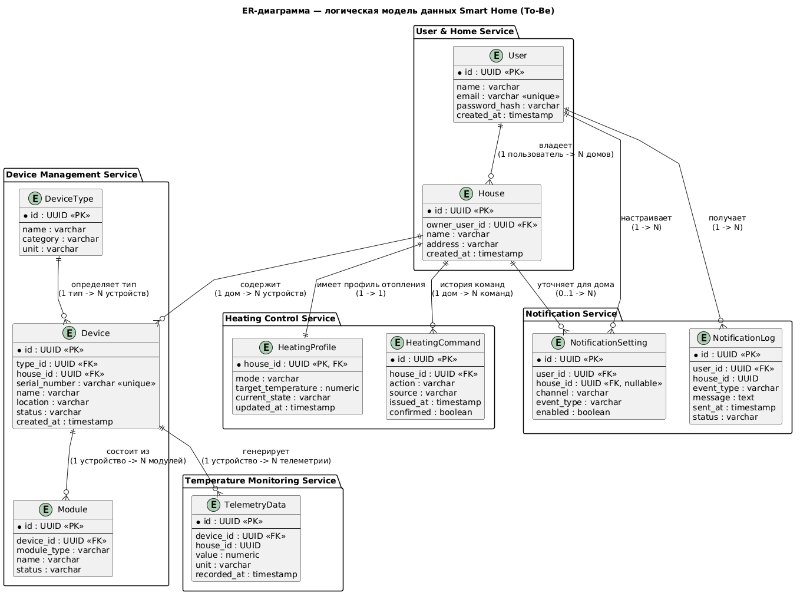

# Задание 4. Создание и документирование API

### 1. Тип API

Используются оба типа, для разных видов взаимодействия — это прямое следствие диаграммы контейнеров (Задание 2):

- **REST (синхронный).** Клиент (веб-приложение через API Gateway) и сервисы, которым нужен немедленный ответ (например, проверка принадлежности дома пользователю), используют REST/JSON. Задокументирован через OpenAPI.
- **AsyncAPI (асинхронный).** Обмен телеметрией и статусами через RabbitMQ не требует немедленного ответа: `Temperature Monitoring Service` публикует показание, а `Heating Control Service`/`Notification Service` реагируют независимо и в своём темпе. Синхронный вызов здесь создал бы ненужную связанность и точку отказа (см. проблему «синхронная зависимость» в Задании 1).

Для документации выбран **Heating Control Service** — самый критичный сервис системы (см. диаграммы кода в Задании 2): он одновременно имеет синхронное REST-API для клиента и асинхронные события для автоматики/уведомлений, поэтому хорошо показывает оба подхода на одном примере.

### 2. Документация API

**REST API — OpenAPI 3.0.** Исходник: [`docs/api/heating-control-openapi.yaml`](docs/api/heating-control-openapi.yaml) (провалидирован `@redocly/cli lint`; открывается в Swagger Editor через File → Import). 5 эндпоинтов:

| Метод | Путь | Назначение |
|---|---|---|
| GET | `/houses/{houseId}/heating` | Получить текущее состояние отопления дома |
| PATCH | `/houses/{houseId}/heating/target-temperature` | Изменить целевую температуру |
| PATCH | `/houses/{houseId}/heating/mode` | Переключить режим (manual/auto) |
| POST | `/houses/{houseId}/heating/commands` | Отправить ручную команду вкл/выкл (аналог «отправки команды устройству») |
| GET | `/houses/{houseId}/heating/commands` | История команд отопления |

Для каждого эндпойнта в спецификации описаны схема запроса/ответа, коды `200/201/400/404/409/502/500` и примеры (`examples`) — подробности см. в самом файле.

> Сверено с реальной реализацией (`apps/microservices/HeatingControlService`, см. «Дополнительно»): изначально сервис создавал профиль отопления для любого `houseId` без проверки, что дом существует, то есть 404 из спецификации никогда бы не возвращался. Добавлена проверка через внутренний эндпоинт User & Home Service (`HouseDirectoryClient`) — теперь код и контракт согласованы.

**Асинхронные события — AsyncAPI 2.6.** Исходник: [`docs/api/heating-events-asyncapi.yaml`](docs/api/heating-events-asyncapi.yaml) (провалидирован `@asyncapi/cli validate`; открывается в AsyncAPI Studio). Описаны 2 канала RabbitMQ:

| Канал | Publisher | Subscriber(s) | Сообщение |
|---|---|---|---|
| `smarthome.temperature.updated` | Temperature Monitoring Service | Heating Control Service, Notification Service | `TemperatureUpdated` |
| `smarthome.heating.state-changed` | Heating Control Service | Notification Service | `HeatingStateChanged` |

# Задание 5. Работа с docker и docker-compose

Перейдите в apps.

Там находится приложение-монолит для работы с датчиками температуры. В README.md описано как запустить решение.

Вам нужно:

1) сделать простое приложение temperature-api на любом удобном для вас языке программирования, которое при запросе /temperature?location= будет отдавать рандомное значение температуры.

Locations - название комнаты, sensorId - идентификатор названия комнаты

```
	// If no location is provided, use a default based on sensor ID
	if location == "" {
		switch sensorID {
		case "1":
			location = "Living Room"
		case "2":
			location = "Bedroom"
		case "3":
			location = "Kitchen"
		default:
			location = "Unknown"
		}
	}

	// If no sensor ID is provided, generate one based on location
	if sensorID == "" {
		switch location {
		case "Living Room":
			sensorID = "1"
		case "Bedroom":
			sensorID = "2"
		case "Kitchen":
			sensorID = "3"
		default:
			sensorID = "0"
		}
	}
```

2) Приложение следует упаковать в Docker и добавить в docker-compose. Порт по умолчанию должен быть 8081

3) Кроме того для smart_home приложения требуется база данных - добавьте в docker-compose файл настройки для запуска postgres с указанием скрипта инициализации ./smart_home/init.sql

Для проверки можно использовать Postman коллекцию smarthome-api.postman_collection.json и вызвать:

- Create Sensor
- Get All Sensors

Должно при каждом вызове отображаться разное значение температуры

Ревьюер будет проверять точно так же.

**Реализация.** `temperature-api` реализован как ASP.NET Core Minimal API (`apps/temperature-api-dotnet`) — `GET /temperature?location=` и `GET /temperature/{sensorId}` возвращают случайное значение (15–30°C) при каждом вызове, с той же логикой определения location/sensorId по умолчанию, что приведена в задании. `docker-compose.yml` в `apps/` дополнен: `postgres` (с `POSTGRES_USER`/`POSTGRES_PASSWORD`, healthcheck и монтированием `./smart_home/init.sql` в `/docker-entrypoint-initdb.d/`, при этом `POSTGRES_DB` намеренно не задан — иначе `CREATE DATABASE smarthome` внутри `init.sql` конфликтует с уже созданной БД), новый сервис `temperature-api` (порт 8081) и сервис `app`, теперь собираемый из `./smart_home-dotnet` (см. пояснение про выбор .NET-реализации монолита вместо исходной Go-версии — обсуждалось в чате). Проверено локально (`dotnet build`/`dotnet run` для обоих .NET-проектов, `docker compose config` для синтаксиса compose-файла); живой прогон `docker-compose up` в этой сессии не получилось выполнить — Docker Desktop не поднялся в среде, поэтому итоговая проверка через Postman-коллекцию (`Create Sensor`, `Get All Sensors`) осталась за пользователем.

---

# Дополнительно: реализация To-Be микросервисной архитектуры (не требуется заданием)

Задание 2 требует только диаграммы C4 (см. текст задания выше — «нужно предоставить только диаграммы»). По отдельной просьбе в чате спроектированная в Задании 2 архитектура была также реализована как реально работающий код — сверх того, что нужно для сдачи проекта. Это отдельный, самостоятельный стек: он **не заменяет и не трогает** `apps/docker-compose.yml`/`apps/smart_home-dotnet`/`apps/temperature-api-dotnet`, за счёт которых сдаётся Задание 5.

## Расположение и состав

Всё находится в `apps/microservices/` (`SmartHome.Microservices.slnx`):

| Сервис | Проект | Роль |
|---|---|---|
| API Gateway | `ApiGateway` (YARP) | Единая точка входа, маршрутизация по `/api/**`, проверка JWT |
| User & Home Service | `UserHomeService` | Регистрация/логин (выдаёт JWT), CRUD домов |
| Device Management Service | `DeviceManagementService` | CRUD устройств, проверка принадлежности дома через User & Home Service |
| Temperature Monitoring Service | `TemperatureMonitoringService` | Фоновый опрос `temperature-sensors-api`, хранение показаний, публикация `TemperatureUpdated` |
| Heating Control Service | `HeatingControlService` | Профиль/команды отопления, автоматика по `TemperatureUpdated`, публикация `HeatingStateChanged` |
| Notification Service | `NotificationService` | Подписка на оба события, лог уведомлений пользователю |
| `Smarthome.Shared` | библиотека | Контракты событий + обёртка над `RabbitMQ.Client`, общие JWT-настройки |
| `HeatingControlService.Tests` | xUnit | Тесты доменной логики автоматики отопления (5 тестов, см. ниже) |

Брокер — RabbitMQ (топик-обмен `smarthome.events`, ключи маршрутизации те же, что в `docs/api/heating-events-asyncapi.yaml`). База — один контейнер PostgreSQL с пятью отдельными базами (`postgres-init.sql`), по одной на сервис — database-per-service соблюдён на уровне подключений, даже если физически это один инстанс Postgres. Симулятор датчиков переиспользует **тот же** проект `apps/temperature-api-dotnet` из Задания 5 (свой отдельный контейнер в этом стеке, порт 8091).

## Как запустить и проверить

```bash
cd apps/microservices
docker compose up --build
```

Порты: Gateway `8090`, User&Home `8092`, Device Management `8093`, Temperature Monitoring `8094`, Heating Control `8095`, Notification `8096`, temperature-sensors-api `8091`, RabbitMQ management UI `15672` (guest/guest).

Демонстрационный сценарий через Gateway (`http://localhost:8090/api/...`):

1. `POST /api/auth/register` `{name, email, password}`
2. `POST /api/auth/login` → получить `token`
3. `POST /api/homes` (Bearer token) `{name, address}` → получить `houseId`
4. `POST /api/devices` (Bearer token) `{houseId, typeName: "temperature_sensor", serialNumber, name, location}` → получить `deviceId`
5. `POST /api/houses/{houseId}/temperature/watches` (Bearer token) `{sensorId: "1", deviceId}` — регистрирует датчик для опроса
6. Подождать ~15 сек (интервал опроса) → `GET /api/houses/{houseId}/temperature` покажет показание, а `GET /api/houses/{houseId}/heating` — что автоматика при необходимости включила отопление
7. `GET /api/users/{userId}/notifications` — если показание было аномальным или отопление переключилось, здесь появится запись

## Что проверено, а что нет

- ✅ Все 7 проектов собираются вместе (`dotnet build` на решении).
- ✅ `dotnet test` — 5/5 тестов домена автоматики отопления (`HeatingProfile.DecideAutoAction`) проходят.
- ✅ `docker compose config` — синтаксис и итоговая конфигурация compose-файла корректны.
- ✅ Heating Control Service сверен построчно с `docs/api/heating-control-openapi.yaml` и `docs/api/heating-events-asyncapi.yaml` — найденное расхождение (отсутствующая проверка существования дома, из-за которой 404 из спецификации не мог случиться) устранено.
- ❌ Живой прогон `docker compose up` в этой сессии не выполнен. Причина найдена: на этой машине не установлен WSL2 (`wsl --status` → «The Windows Subsystem for Linux is not installed»), без которого движок Docker Desktop на Windows не поднимается вообще (отсюда стабильный `500 Internal Server Error` на всех попытках). Исправление — `wsl --install` и перезагрузка; это системное изменение, поэтому оно не выполнялось без вашего решения.

## Осознанные упрощения относительно диаграмм Задания 2

- Общий symmetric JWT-ключ передаётся как обычная переменная окружения с dev-значением по умолчанию — для реального окружения его нужно заменить и хранить как секрет.
- Сущность `NotificationSetting` из ER-диаграммы не реализована — Notification Service пока уведомляет всегда (по фиксированным правилам: аномальная температура, любая смена состояния отопления), без пользовательских настроек подписки. `Module`, ранее тоже не реализованный, добавлен в Device Management Service (`POST/GET/DELETE /devices/{deviceId}/modules`).
- Проверка прав доступа к дому в Device Management Service выполняется только на создании устройства, не на чтении (осознанное упрощение, чтобы не проверять авторизацию на каждом read-эндпоинте).
- «Оборудование отопления» и канал уведомлений (Email/Push) — симулированы (лог + короткая задержка), так как реальных внешних систем для них нет.
- Temperature Monitoring Service узнаёт, какие датчики опрашивать, через явную регистрацию (`POST .../temperature/watches`), а не через синхронный вызов Device Management Service — такой связи не было на диаграмме контейнеров Задания 2, поэтому её не стали добавлять неявно.


